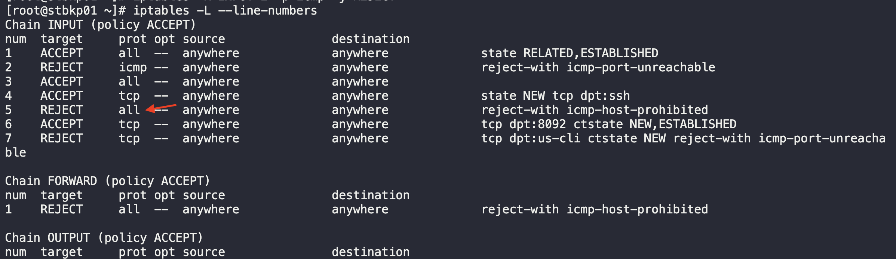
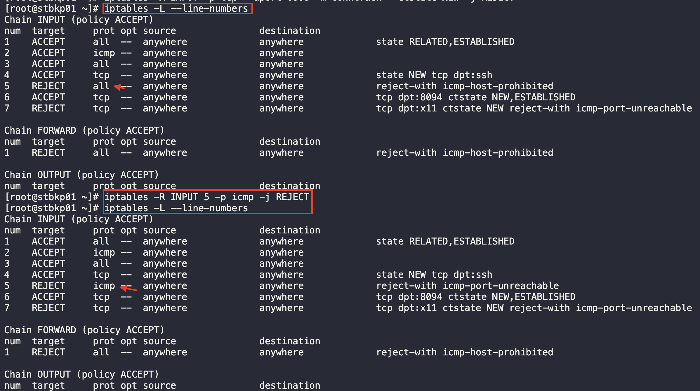

We have a backup management application UI hosted on Nautilus's backup server in Stratos DC. That backup management application code is deployed under Apache on the backup server itself, and Nginx is running as a reverse proxy on the same server. Apache and Nginx ports are 6000 and 8094, respectively. We have iptables firewall installed on this server. Make the appropriate changes to fulfill the requirements mentioned below:

We want to open all incoming connections to Nginx's port and block all incoming connections to Apache's port. Also make sure rules are permanent.

BACKUP-SERVER
=============
    1  systemctl status iptables
    2  ss -tlnp |grep httpd     
    3  ss -tlnp |grep nginx
    4  systemctl start iptables
    5  systemctl status iptables
    6  iptables -A INPUT -p tcp --dport 8094 -m conntrack --ctstate NEW,ESTABLISHED -j ACCEPT
    7  iptables -A INPUT -p tcp --dport 6000 -m conntrack --ctstate NEW -j REJECT
    8  iptables -L --line-numbers                                                                    - CHANGE LINE 5 TO ICMP
       
    9  iptables -R INPUT 5 -p icmp -j REJECT
   10  iptables -L --line-numbers
       
   11  service iptables save
   12  telnet stbkp01 6000                                                                           - REACH APACHE FROM JUMP SERVER
   13  telnet stbkp01 8094                                                                           - REACH NGINX FROM JUMP SERVER
 