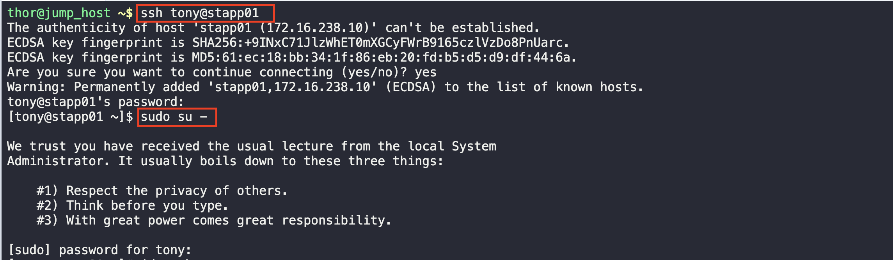

# Create a Linux User with non-interactive shell

1. Log into the server and as the root user 

2. Check to see if the user exist

3. Add the user 
> /sbin/nologin is specifically designed to switch a shell and produces output complaining you cannot log-in.

4. Validate that the user is created

