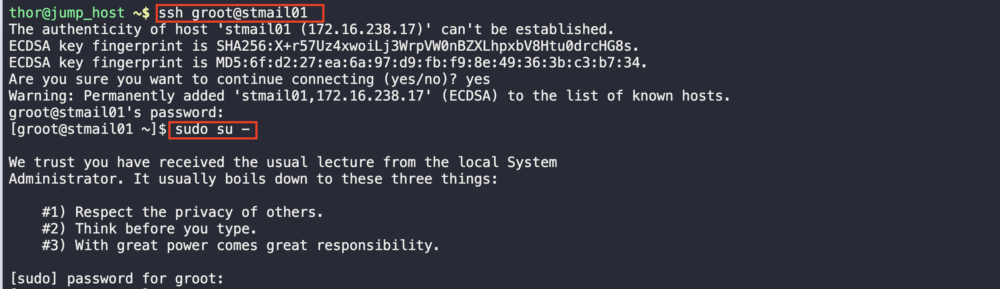
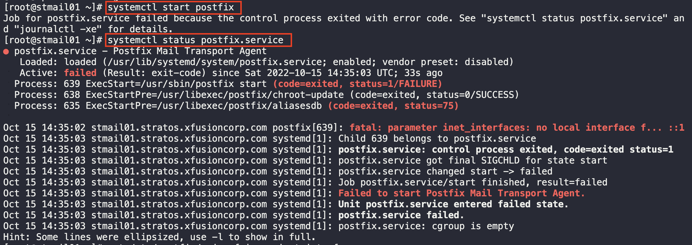
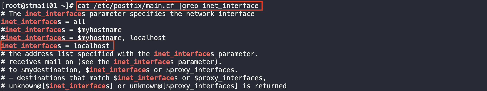
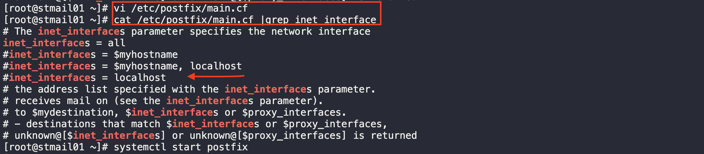
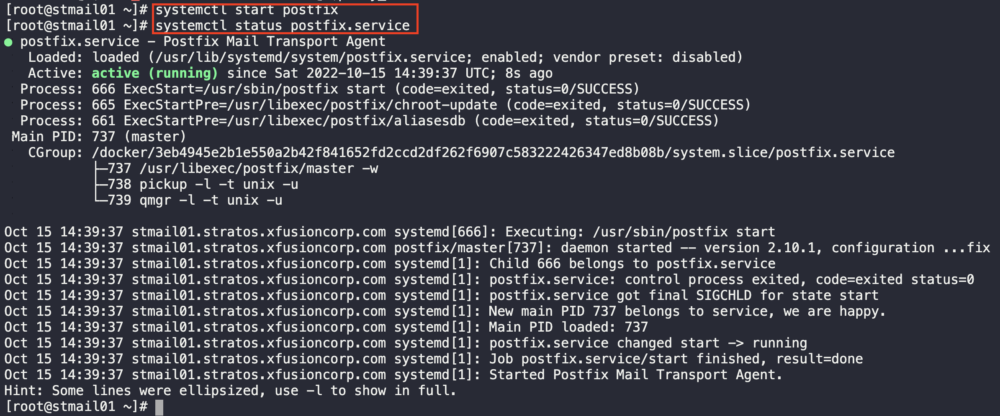

# Linux PostFix TroubleShooting

1. Log into the server and as the root user 

2. Start the PostFix service and check for the status 

3. The error is caused by a wrong parameter declaration

4. To fix the error go into the file and comment out the inet_interfaces paarameter

5. Start the service again and check for the status

