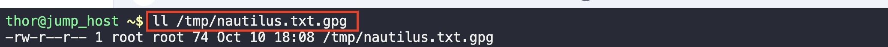
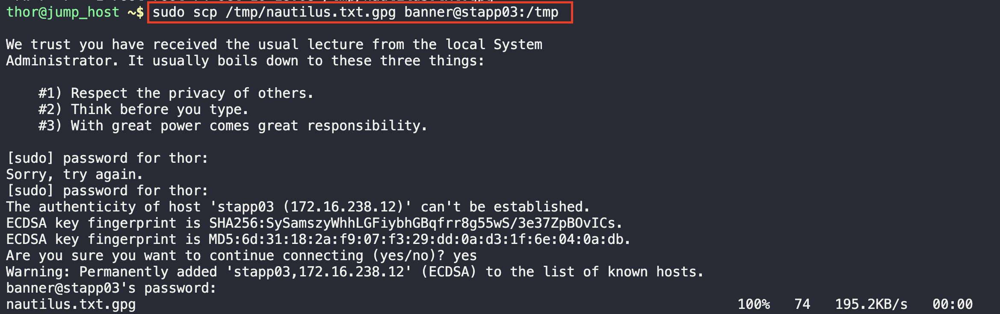
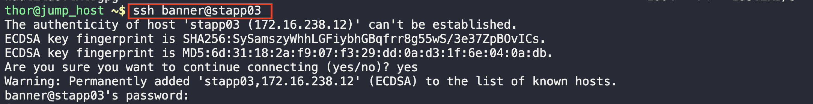
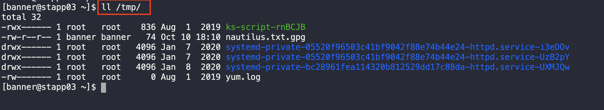

# Linux Remote Copy
One of the Nautilus developers has copied confidential data on the jump host in Stratos DC. That data must be copied to one of the app servers. Because developers do not have access to app servers, they asked the system admins team to accomplish the task for them.

Copy /tmp/nautilus.txt.gpg file from jump server to App Server 1 at location /home/webdata.

1. Check for the file permissions

2. Copy the files to the server temporarily

3. SSH into the server

4. Check that the file exists in the tmp directory

5. Move the file to the specified directory 
