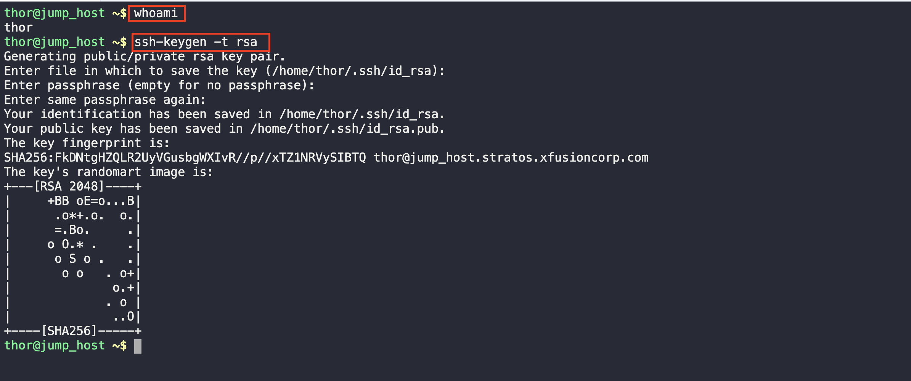
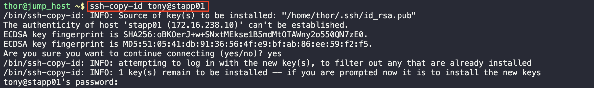

# Linux SSH Authentication

1. Confirm the current user and generate a key  pair

2. Copy the ID to the user server

3. Try logging into the user server to see if there's a need for a password and confirm the user

