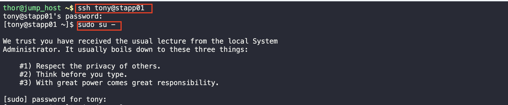
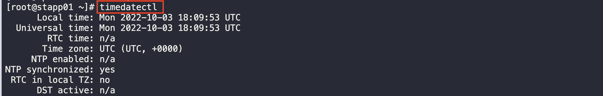
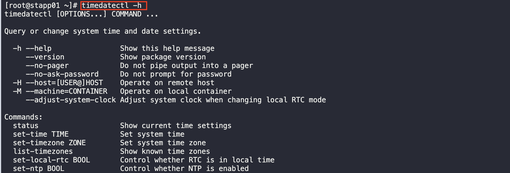
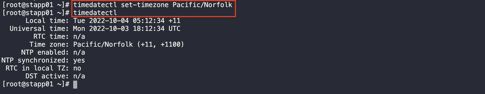

# Linux Time-Zone Settings

1. Log into the application and switch to root

2. Check the current timezone by running the command below

3. Use the help command to see what command to use to set the timezone

4. Set the timezone by using the command and check the status

5. Do the same for the other servers 
