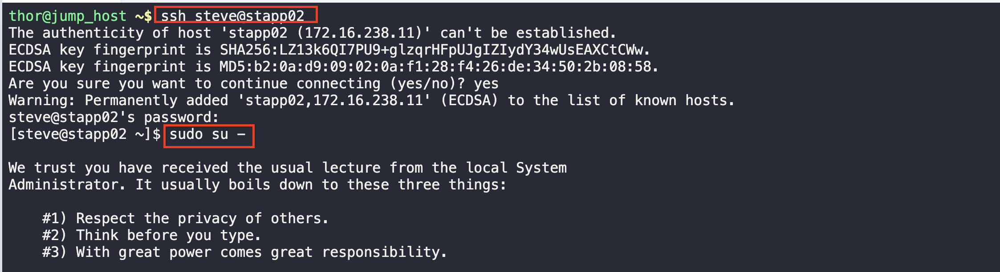
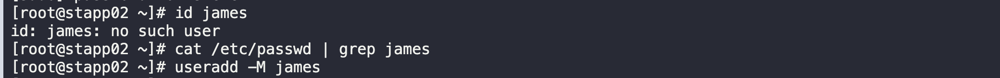
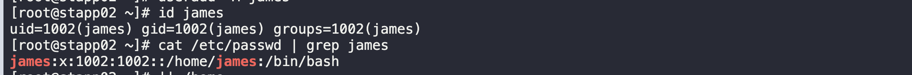
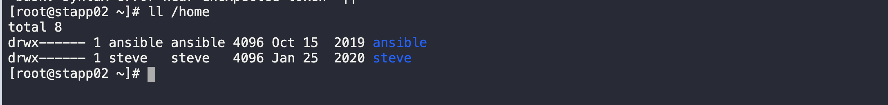

# Create a Linux User without home

1. Log into the server and as the root user 

2. Check if the user exits, if they don't add them using the useradd command

3. Confirm they've been added

4. Just to confirm that their not in the home directory

Some users of the monitoring app have reported issues with xFusionCorp Industries mail server. They have a mail server in Stork DC where they are using postfix mail transfer agent. Postfix service seems to fail. Try to identify the root cause and fix it.

